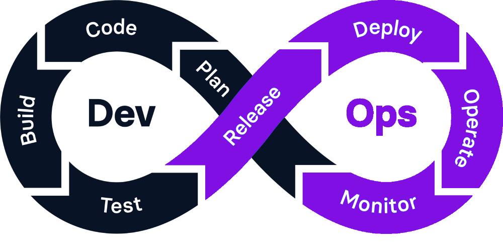

# DevOps

## ¿Qué es DevOps?

El término DevOps proviene de la combinación de los términos "development" (desarrollo) y "operations" (operaciones), y promueve la coordinación y colaboración de estos dos equipos para ofrecer productos de mejor calidad, más confiables y de forma más rápida. De esta manera, se pone fin al aislamiento entre los equipos de desarrollo y operaciones.

Al adoptar DevOps se adopta un conjunto de prácticas, herramientas y filosofía que permite automatizar e integrar procesos que comparten los equipos de desarrollo y de operaciones.

## Fases del ciclo de vida en DevOps

En el marco de trabajo DevOps el equipo de desarrollo y de operaciones de TI colaboran durante todo el ciclo de vida de un producto. 

En DevOps el ciclo de vida no es un proceso lineal con un final, sino que cada fase es contínua y se retroalimenta del resto de fases. Por ello, se utiliza un bucle infinito para representar esas fases y cómo se relacionan entre sí. Este bucle representa la necesidad de mejora y colaboración constante en cada iteración a lo largo de todo el ciclo de vida del producto.
 

  

En DevOps se pueden identificar las siguientes fases:

1. **Planificación**: En esta fase se definen los objetivos, requisitos y tareas del proyecto a partir de los requisitos proporcionados por el cliente. En esta fase se utilizan herramientas de gestión de proyectos para organizar y priorizar las tareas. Algunas de las más utilizadas son Jira y Trello.

2. **Codificación**: el equipo de desarrollo se encarga de escribir el código e integrarlo en un repositorio compartido. En esta fase es necesario utilizar herramientas que permitan almacenar, compartir y llevar un control de versiones de todo el código. Algunas herramientas utilizadas son GitHub y GitLab.
   
3. **Construcción**: En esta fase el código se compila para poder ser ejecutado y se construyen los artefactos necesarios para la compilación. Aquí se incluye la automatización de la construcción del software para asegurar la consistencia y eficiencia en diferentes plataformas y entornos de despligue (pruebas, preproducción, producción...). Algunas herramientas utilizadas en esta fase son Docker, Ansible, Puppet o JFrog ARtifactory. Estas herramientas nos permiten gestionar versiones y compilaciones. 

4. **Pruebas**: Una vez construido el código se realizan pruebas automatizadas y manuales para asegurar que el software funciona de forma correcta y cumple con los requisitos necesarios. Las pruebas continuas ayudan a identificar y corregir errores de forma rápida. Herramientas como JUnit, Selenium o Codeception permiten programar estas pruebas.

5. **Liberación (Release)**: En esta fase se asegura que todas las dependencias estén en su lugar y que el software esté listo para ser utilizado en producción.

6. **Despliegue o Implementación**: El software se despliega en el entorno de preproducción y producción. La implementación continua permite que los cambios se entreguen rápidamente y con menos riesgo.

7. **Operaciones**:  El software se monitorea en producción para asegurar su rendimiento y disponibilidad. Se utilizan herramientas de monitoreo y registro para detectar y resolver problemas.
   
8. **Monitorización - Retroalimentación**: Se recopilan datos y comentarios de los usuarios y del sistema para identificar áreas de mejora. Esta información se utiliza para planificar futuras actualizaciones y mejoras, realimentando de esta manera la fase de planificación. Algunas herramientas que se pueden utilizar para ello son Grafana y Prometheus, herramientas que nos permiten obtener medidas sobre el rendimiento del sistema, incluyendo uso de la memoria y CPU, tráfico de red, tiempos de respuesta etc. 

## Las 7Cs de DevOps
Las fases del ciclo de vida en DevOps se agrupan en lo que se conoce como las 7Cs, que se encargan de gruiar el proceso de desarrollo de software de principio a fin y de una forma contínua: desarrollo contínuo (CD), intengración contínua (CI), pruebas contínuas, despliegue contínuo, retroalimentación contínua, monitorización contínua y operaciones contínuas

1. **Desarrolo contínuo (CD)**: esta fase implica la planificación y codificación del software. DevOps fomenta lanzamientos de software regulares y frecuentes. Para ello, cada vez que se crea un trozo de código, se prueba, se construye y se despliega en producción. De esta manera, se mejora la calidad del código y se agiliza la detección y correción de fallos.
   
3. **Integración contínua (CI)**: cuando el desarrollador finaliza una parte del código en su máquina, lo integra en el repositorio compartido. Una vez allí se construye una versión de la apliación y se pasa la batería de pruebas, lo que ayuda a detectar errores rápidamente.
   
7. **Pruebas contínuas**: las pruebas se automatizan para garantizar que cada cambio de código sea seguro y funcione adecuadamente.

9. **Despliegue contínuo**: consiste en el proceso de desplegar la aplicación de forma automática en el entorno de producción cuando se hayan completado las fases de pruebas y constucción.
   
10. **Retroalimentación contínua**: una vez los usuarios utilizan la aplicación nos pueden enviar comentarios sobre el redimiento, fallos detectados o cualquier otra cosa que afecte a la experiencia del usuario. Gracias a esta retroalimentación continua se mejora el rendimiento de la aplicación y se reducen los fallos en el código.
    
12. **Monitorización contínua**: consiste en la supervisión constante de las aplicaciones y de la infraestructura que las aloja para detectar y resolver problemas rápidamente.
   

14. **Operaciones contínuas:**

---

### Ejercicio 1:

En [este video](https://www.youtube.com/watch?v=XU0llRltyFM)  tienes un resumen del marco de trabajo Scrum. Después de verlo, intenta responder a las siguientes preguntas:

- ¿Qué es un sprint en Scrum?
- ¿Quién es el encargado de priorizar las tareas a realizar en cada sprint?
- ¿Cómo se puede calcular la fecha final de entrega de un sprint?
