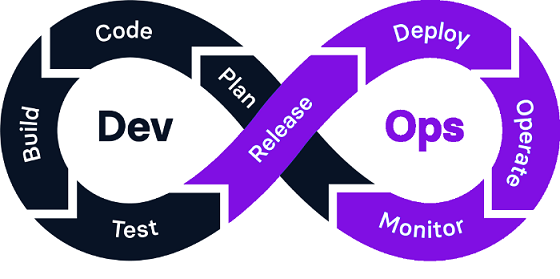

# DevOps

## ¿Qué es DevOps?

El término DevOps proviene de la combinación de los términos "development" (desarrollo) y "operations" (operaciones), y promueve la coordinación y colaboración de estos dos equipos para ofrecer productos de mejor calidad, más confiables y de forma más rápida. De esta manera, se pone fin al aislamiento entre los equipos de desarrollo y operaciones.

Al adoptar DevOps se adopta un conjunto de prácticas, herramientas y filosofía que permite automatizar e integrar procesos que comparten los equipos de desarrollo y de operaciones.

## Fases del ciclo de vida en DevOps

En el marco de trabajo DevOps el equipo de desarrollo y de operaciones de TI colaboran durante todo el ciclo de vida de un producto.
 

  

En DevOps se utiliza un bucle infinito para representar las fases del ciclo de vida y cómo se relacionan esas fases entre sí. Estas fases son:

1. **Planificación**: En esta fase se definen los objetivos, requisitos y tareas del proyecto a partir de los requisitos proporcionados por el cliente. En esta fase se utilizan herramientas de gestión de proyectos para organizar y priorizar las tareas. Algunas de las más utilizadas son Jira y Trello.

2. **Codificación**: el equipo de desarrollo se encarga de escribir el código e integrarlo en un repositorio compartido. En esta fase es necesario utilizar herramientas que permitan almacenar, compartir y llevar un control de versiones de todo el código. Algunas herramientas utilizadas son GitHub y GitLab.
   
3. **Construcción**: En esta fase el código se compila para poder ser ejecutado y se construyen los artefactos necesarios para la compilación. Aquí se incluye la automatización de la construcción del software para asegurar la consistencia y eficiencia en diferentes plataformas y entornos de despligue (pruebas, preproducción, producción...). Algunas herramientas utilizadas en esta fase son Docker, Ansible, Puppet o JFrog ARtifactory. Estas herramientas nos permiten gestionar versiones y compilaciones. 

4. **Pruebas**: Una vez construido el código se realizan pruebas automatizadas y manuales para asegurar que el software funciona de forma correcta y cumple con los requisitos necesarios. Las pruebas continuas ayudan a identificar y corregir errores de forma rápida. Herramientas como JUnit, Selenium o Codeception permiten programar estas pruebas.

5. **Liberación (Release)**: En esta fase se asegura que todas las dependencias estén en su lugar y que el software esté listo para ser utilizado en producción.

6. **Despliegue o Implementación**: El software se despliega en el entorno de preproducción y producción. La implementación continua permite que los cambios se entreguen rápidamente y con menos riesgo.

   
7. **Operaciones**:  El software se monitorea en producción para asegurar su rendimiento y disponibilidad. Se utilizan herramientas de monitoreo y registro para detectar y resolver problemas.

   
8. **Monitorización, Retroalimentación**: Se recopilan datos y comentarios de los usuarios y del sistema para identificar áreas de mejora. Esta información se utiliza para planificar futuras actualizaciones y mejoras

## Las 7Cs de DevOps
Las fases del ciclo de vida en DevOps se pueden agrupar en 7 Cs para mayor claridad:

1. **Desarrolo contínuo (CD)**: esta fase implica la planificación y codificación del software.
    -**Planificación**: En esta fase se definen los objetivos, requisitos y tareas del proyecto a partir de los requisitos proporcionados por el cliente. En esta fase se utilizan herramientas de gestión de proyectos para organizar y priorizar las tareas. Algunas de las más utilizadas son Jira y Trello.

**Codificación**: el equipo de desarrollo se encarga de escribir el código e integrarlo en un repositorio compartido. En esta fase es necesario utilizar herramientas que permitan almacenar, compartir y llevar un control de versiones de todo el código. Algunas herramientas utilizadas son GitHub y GitLab.
3. **Integración contínua (CI):**
4. **Pruebas contínuas:**
5. **Despliegue contínuo :**
6. **Retroalimentación contínua:**
7. **Monitorización contínua:**
8. **OPeraciones contínuas:**

---

### Ejercicio 1:

En [este video](https://www.youtube.com/watch?v=XU0llRltyFM)  tienes un resumen del marco de trabajo Scrum. Después de verlo, intenta responder a las siguientes preguntas:

- ¿Qué es un sprint en Scrum?
- ¿Quién es el encargado de priorizar las tareas a realizar en cada sprint?
- ¿Cómo se puede calcular la fecha final de entrega de un sprint?
