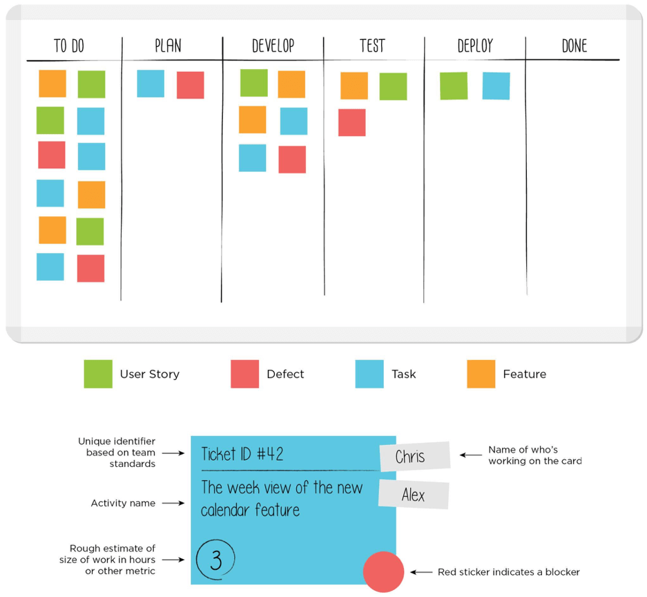

# Kanban

Kanban es otra metodología ágil, que es realmente fácil de aplicar. Su nombre es una combinación de dos palabras japonesas: *kan* ("visual") y *ban* ("tarjeta"), por lo que podemos deducir que el componente principal de esta metodología consiste en usar tarjetas que representan las diferentes tareas que debemos completar en el proceso de desarrollo.

Los orígenes de la metodología Kanban se remontan a más de 60 años. A finales de la década de 1940, Toyota comenzó a optimizar sus procesos de ingeniería, basándose en el mismo modelo que utilizaban los supermercados para optimizar su stock. Dado que los niveles de inventario debían coincidir con los patrones de consumo, el exceso de stock podía (y debía) controlarse. De este modo, Toyota pudo alinear sus niveles de inventario con su consumo real de materiales. Los trabajadores pasaban una tarjeta entre equipos cuando un contenedor de materiales se había vaciado, indicando la cantidad exacta de material necesario. El almacén tenía listo un nuevo contenedor de material para entregar a la fábrica, y luego enviaban una nueva tarjeta Kanban al proveedor para que suministrara un nuevo contenedor.

Aplicado a los procesos de desarrollo de software, Kanban permite a los equipos ajustar la cantidad de trabajo en curso (WIP) a la capacidad del equipo. Esto da a los equipos opciones de planificación más flexibles, una salida más rápida y un enfoque más claro.

## **Proceso**

El término general para referirse a la metodología Kanban es **flujo**, ya que el trabajo fluye continuamente a través del sistema en lugar de estar organizado en bloques de tiempo, como hace Scrum con sus sprints.

Kanban utiliza mecanismos visuales, como los tableros Kanban, para que los miembros del equipo puedan ver el estado de cada tarea en cualquier momento. Estos tableros pueden ser físicos y/o virtuales.

  

La función principal del tablero Kanban es asegurar que el trabajo del equipo sea visualizado y que cualquier bloqueo o dependencia sea detectado inmediatamente. El tablero más básico tiene tres secciones (Por hacer, En progreso y Hecho), pero podemos añadir tantas columnas y estados como necesitemos en nuestro caso particular.

Cualquier sección o columna de un tablero Kanban puede llenarse con tarjetas Kanban. Estas reflejan información crítica sobre un elemento de trabajo particular, proporcionando al equipo información sobre quién es responsable de esa tarea, una breve descripción del trabajo a realizar y una estimación de cuánto tiempo tomará.

## **Principios**

Algunos de los principales principios de la metodología Kanban son:

- **Trabajo en progreso limitado**, o "deja de empezar y empieza a terminar", es decir, el equipo no debe empezar otra tarea hasta que la actual haya sido terminada.
- **Calidad garantizada**: todo debe salir bien a la primera, no hay margen de error. De esta manera, la velocidad no es tan importante como la calidad, ya que corregir errores puede ser costoso.
- **Reducción de desperdicio**: debemos hacer solo lo que necesitamos y hacerlo bien.
- **Flexibilidad**: el siguiente paso se decide a partir del backlog, eligiendo la siguiente tarea a completar. Así, podemos priorizar la tarea elegida según las necesidades de cada momento concreto.
  

## Kanban vs Scrum

Kanban tiene algunas similitudes con la metodología Scrum, ya que ambas son metodologías ágiles: ambas requieren equipos colaborativos y autogestionados, y ambas se enfocan en lanzar software con mucha frecuencia. Sin embargo, existen algunas diferencias importantes entre ellas:

| **Kanban**                         | **Scrum**                          |
| ----------------------------------- | ----------------------------------- |
| No tiene roles prescritos           | ScrumMaster, Product Owner, etc.    |
| Entregas continuas                  | Sprints con límites de tiempo       |
| Se pueden hacer cambios en cualquier momento | No se permiten cambios durante el sprint |

Ambas metodologías se pueden aplicar al mismo tiempo. Scrum es más adecuado para dar retroalimentación al equipo y en la planificación a corto plazo, mientras que Kanban puede ser utilizado para el trabajo diario o en entornos con un alto grado de variabilidad en las prioridades.

---

## Ejercicio 2:

En [este video](https://www.youtube.com/watch?v=R8dYLbJiTUE) tienes un ejemplo de la metodología Kanban. Intenta responder a estas preguntas después de verlo:

1. ¿Cuál es la función principal de los límites de WIP? ¿Qué sucede cuando intentamos mover una tarea a una columna que excede este límite?
   
3. ¿Cómo se pueden combinar Kanban y Scrum? ¿Cuál es el propósito principal de agregar Scrum a Kanban?

---
